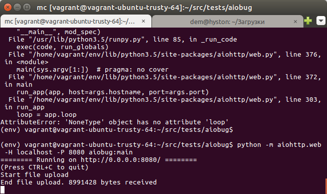
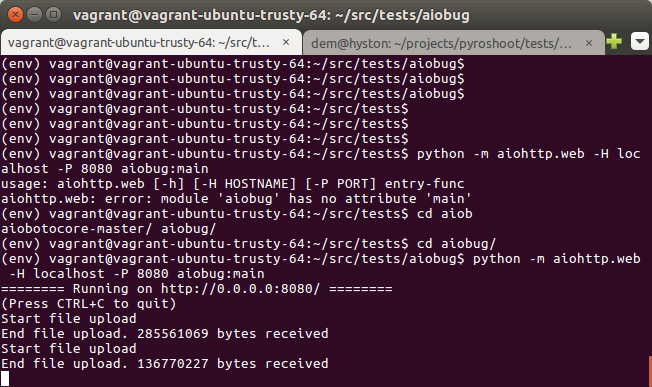
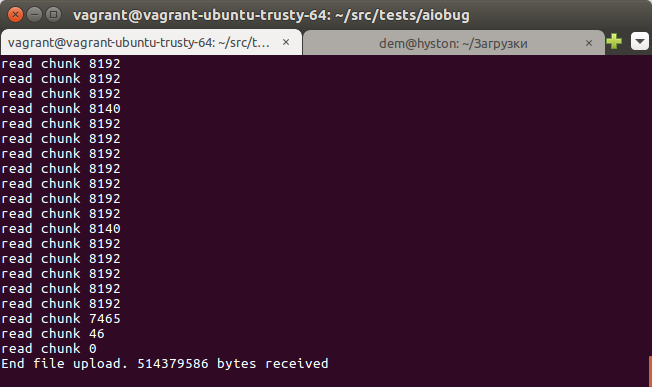

Description
===========

Multipart upload Bug demonstration.

Run demo:
python -m aiohttp.web -H localhost -P 8080 aiobug:main
open browser at http://localhost:8080/
Try to upload BIG (0.5Gb) file.
Check filesize.

Russian
=================

Пакет демонстрирует странное поведение aiohttp при загрузке больших файлов
с помощью multipart.

Для запуска можно использовать команду

::

    python -m aiohttp.web -H localhost -P 8080 aiobug:main open browser at http://localhost:8080/

Далее в браузере открыть http://localhost:8080/ и можно пробовать загружать файлы.

При загрузке маленького (менее 200 мегабайт) файла все проходит хорошо (на скриншоте я грузил файл
размером 8991428 байт).

При загрузке большого файла загрузка обрывается, серверная часть считает,
что все прошло хорошо и потом внезапно серверная часть считает, что началась новая загрузка
(на скриншоте я грузил файл размером 514379586 байт).

 При этом итоговый размер всеравно не совпадает (браузер отваливается по ошибке
ERR_CONNECTION_RESET).

Попытка отладить приводит к файлу aiohttp/multipart.py

Берем файл multipart.py, модифицируем _read_chunk_from_stream вставляя print

::

  @asyncio.coroutine
    def _read_chunk_from_stream(self, size):
        """Reads content chunk of body part with unknown length.
        The `Content-Length` header for body part is not necessary.

        :param int size: chunk size

        :rtype: bytearray
        """
        assert size >= len(self._boundary) + 2, \
            'Chunk size must be greater or equal than boundary length + 2'
        first_chunk = self._prev_chunk is None
        if first_chunk:
            print("first_chunk")
            self._prev_chunk = yield from self._content.read(size)

        chunk = yield from self._content.read(size)
        print("read chunk", len(chunk))
        self._content_eof += int(self._content.at_eof())
        assert self._content_eof < 3, "Reading after EOF"
        window = self._prev_chunk + chunk
        sub = b'\r\n' + self._boundary
        if first_chunk:
            idx = window.find(sub)
        else:
            idx = window.find(sub, max(0, len(self._prev_chunk) - len(sub)))
        if idx >= 0:
            # pushing boundary back to content
            self._content.unread_data(window[idx:])
            if size > idx:
                self._prev_chunk = self._prev_chunk[:idx]
            chunk = window[len(self._prev_chunk):idx]
            if not chunk:
                print("read chunk", len(chunk))
                self._at_eof = True
        if 0 < len(chunk) < len(sub) and not self._content_eof:
            self._prev_chunk += chunk
            self._at_eof = False
            return b''
        result = self._prev_chunk
        self._prev_chunk = chunk
        return result

Ошибка исчезла все грузится нормально

